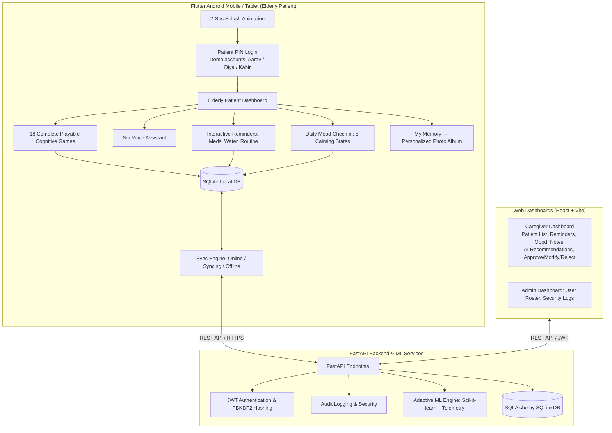

# Team Zenith — Neural Nexus (TS24)

> **"Small Steps. Stronger Memories."**  
> AI-Based Cognitive Gaming and Memory Assistance Platform for Elderly Dementia Patients in the North Eastern Region (NER).  
> **SIH Problem Statement ID:** 26003 | **Theme:** MedTech / HealthTech | **Category:** Software

---

## 1. Project Overview

**Neural Nexus** is a specialized cognitive engagement, memory assistance, and caregiver-support platform specifically designed for elderly individuals experiencing memory challenges and early cognitive decline.

Built for the multi-cultural context of India's North Eastern Region (NER), Neural Nexus bridges the gap between rural low-connectivity home care and clinical oversight.

### Key Pillars
- **Elderly-Friendly Touch UI:** Large tactile cards, soft pastel gradients, 3D companion illustrations, and zero confusing gestures or tiny touch targets.
- **18 Playable Cognitive Games:** Covering Memory, Attention, Pattern Recognition, Daily Routine Sequence, Language, Auditory Memory, and Emotion.
- **Explainable Adaptive AI Engine:** Dynamically modulates game challenge from Level 1 to Level 5 based on multi-session telemetry:
  $$\text{Performance Score} = 0.40 \times \text{Accuracy} + 0.25 \times \text{Speed} + 0.20 \times \text{Consistency} + 0.15 \times \text{Completion}$$
- **Role Separation & Data Isolation:** Dedicated isolated workspaces for Patients (**Ifra**, **Taiba**), Caregivers (**Ananya**), Healthcare Workers (**Dr. Ritasri**), and System Admins.
- **Offline-First Architecture:** Local SQLite databases queue game sessions and reminder completions when offline, syncing automatically via batch endpoints when connectivity is restored.
- **NIA Voice Assistant:** Neural Interactive Assistant supporting voice commands and text-to-speech fallback.
- **Multilingual Localization:** Out-of-the-box support for English, Hindi, and Assamese (অসমীয়া), architected for expansion to additional NER regional languages.
- **Medical Ethics & Safety:** Strictly non-diagnostic; provides cognitive stimulation and caregiver assistance without clinical labeling.

---

## 2. Product Workflow

```mermaid
flowchart TD
    A[1. Account Creation<br/>User creates account with basic details] --> B[2. User Login]
    B --> C1

    subgraph Day1["Day 1 — Fixed Story-Based Assessment (Compulsory)"]
        C1[10 Story Questions<br/>Personal life, family, preferences,<br/>favourite things, routine, etc.]
        C1 --> C2{User Response}
        C2 -->|Answer| C3[Continue]
        C2 -->|Skip — no penalty| C3
        C3 --> C4[After 10 Questions<br/>No more questions this day]
    end

    C4 --> D[Play Games<br/>2-3 games]
    D --> E[Popup: Your reward is ready]
    E --> F[Go to Reward Section<br/>1-2 questions only]
    F --> G[Get Reward<br/>Reward is given and displayed]
    G --> H[Home — Next step]

    H --> I

    subgraph Daily["Daily Flow — Day 2 Onwards"]
        I[User Logs In] --> J[Popup: Your reward is ready — Daily]
        J --> K[Go to Reward Section<br/>1-2 questions only]
        K --> L[Get Reward]
        L --> M[Home — Choose any section]
        M --> N[Games<br/>Play cognitive games, 1+]
        M --> O[Activities<br/>Gardening, music, painting, stories]
        M --> P[Reward Section<br/>1-2 questions to reward]

        N --> Q[Data Recording<br/>Game performance, activity choices,<br/>question answers, behaviour & engagement]
        O --> Q
        Q --> R[AI Analysis<br/>Analyse data, build user profile,<br/>track progress & preferences]
        R --> S[Updated Patient Profile<br/>Interests, preferences, routine,<br/>familiar themes, others]
        S --> T[After 3-4 Days<br/>Caregiver Assigned, based on collected data]
    end

    T --> U

    subgraph CaregiverFlow["Caregiver Dashboard & Recommendation Flow — no phone call; review and decision happen entirely on the dashboard"]
        U[View All Data<br/>Answers, game performance,<br/>activity choices, behaviour] --> V[AI Recommendation<br/>Suggested activities & games]
        V --> W[Caregiver Review<br/>Verify and modify as needed]
        W --> X[Approve / Modify / Reject<br/>Final recommendation]
        X --> Y[Update Plan<br/>Personalized activities & games for user]
    end

    Y --> Z

    subgraph Cycle["Continuous Cycle"]
        Z[User Plays<br/>Games / Activities] --> Z2[Data Collected]
        Z2 --> Z3[AI Updates Profile & Recommendation]
        Z3 --> Z4[Caregiver Reviews & Updates Plan]
        Z4 --> Z5[User Gets Personalized Experience]
        Z5 -.->|Repeat Daily| Z
    end
```



All 10 story questions are asked together on Day 1, not spread one-per-day across 10 days.
Caregiver review happens entirely through the dashboard — there is no phone call step.

---

## 3. System Architecture



## 3. Repository Structure

```
Team-Zenith_TS24/
├── Neural Nexus/
│   ├── backend/               # FastAPI backend with SQLite, JWT Auth, RBAC, and tests
│   │   ├── app/               # API routers, models, schemas, and database configuration
│   │   ├── tests/             # 14 Pytest integration and security test cases
│   │   ├── requirements.txt   # Python backend dependencies
│   │   └── seed_demo_data.py  # Seed script for demo patients, 18 games, and records
│   ├── adaptive_engine/       # Multi-session adaptive difficulty and telemetry ML engine
│   │   ├── difficulty_engine.py
│   │   ├── performance_analyzer.py
│   │   ├── recommendation_engine.py
│   │   └── tests/             # Adaptive engine unit test suite (6 passing tests)
│   ├── web/                   # Caregiver & Healthcare Worker web portals (React + Vite)
│   │   ├── src/               # React components, dashboards, and services
│   │   └── package.json       # Frontend dependencies and build scripts
│   ├── mobi/                  # Elderly Patient mobile/tablet app (Flutter & Android)
│   │   ├── lib/               # Dart screens, 18 playable games, and sync engine
│   │   ├── android/           # Android native Gradle project configuration
│   │   └── pubspec.yaml       # Flutter dependencies
│   ├── docker-compose.yml     # Containerized orchestration for backend and web
│   ├── RUN_PATIENT_APP.bat    # One-click Windows launcher for local deployment
│   └── launcher_port_resolver.ps1 # Smart port conflict and fallback manager
├── .gitignore                 # Clean repository exclusions
└── README.md                  # Unified Master Documentation
```

---

## 4. Demo Credentials

| Role | Username / Email | PIN / Password | Description |
| :--- | :--- | :--- | :--- |
| **Patient 1** | `Aarav` | PIN: `1234` | Patient profile with 2 completed games, 2 pending reminders, calm mood |
| **Patient 2** | `Aaita` | PIN: `1234` | Patient profile with isolated history, routine game, Hindi language |
| **Caregiver** | `caregiver@neuralnexus.demo` | `Caregiver@123` | Ananya Sharma: Patient tracker, reminders manager, My Memory album |

---
## 5. Complete Cognitive Game Library (18 Playable Games)

1. **Remember the Objects** (`memory`): Memorize 3–5 everyday objects for 6 seconds, hide, and select which items were shown.
2. **Memory Match** (`memory`): Flip cards to find matching pairs of familiar objects (3 to 6 pairs).
3. **Daily Routine Order** (`routine`): Arrange morning activities using accessible Up/Down touch controls.
4. **Find the Different Object** (`attention`): Spot the odd item out from a grid (e.g. 🍎 🍎 🍎 🍊 🍎).
5. **Twin Shapes & Colors** (`attention`): Match objects by color, shape, or exact twin.
6. **Pattern Completion** (`pattern`): Complete visual patterns (Circle &rarr; Square &rarr; Circle &rarr; ?).
7. **Object Categorization** (`pattern`): Sort everyday objects into Food, Clothes, Medicine, or Household.
8. **Story Recall** (`language`): Listen to a soothing short story and answer accessible multi-choice questions.
9. **Emotion Recognition** (`emotion`): Identify feelings from friendly, smiling, or surprised faces.
10. **Face & Name Memory** (`memory`): Personalized game recalling family members and caregivers (*"Who is Meena?"*).
11. **Location Memory** (`memory`): Recall where household items were placed (Keys in Drawer, Cup on Table).
12. **Sound Memory** (`auditory`): Remember and repeat sequences of soothing everyday sounds (Bell, Water, Bird).
13. **Word Recall** (`language`): Recall comforting words shown earlier in the session.
14. **Object Recognition** (`language`): Recognize everyday items with multilingual audio and text labels.
15. **Simple Sequence Recall** (`memory`): Sequential item order recall.
16. **Which One is Missing?** (`memory`): Identify which object was removed from a group.
17. **Match Related Pairs** (`pattern`): Pair associated items (Cup + Saucer, Lock + Key, Toothbrush + Paste).
18. **Picture & Word Match** (`language`): Connect pictures of everyday items with their written names.

---

## 6. Quick Start & Execution Guide

### Prerequisites
- **Python 3.10+** (tested and fully compatible with Python 3.14)
- **Node.js 18+** & npm
- *(Optional for Mobile APK compilation)* **Flutter SDK 3.x+** & Android SDK

---

### Step 1: Set Up & Launch FastAPI Backend
```bash
cd "Neural Nexus"

# 1. Install backend dependencies
pip install -r backend/requirements.txt

# 2. Seed database with demo patients, 18 games, and clinical records
python backend/seed_demo_data.py

# 3. Launch FastAPI backend server
uvicorn backend.app.main:app --host 127.0.0.1 --port 8000 --reload
```
- **API Root**: `http://127.0.0.1:8000/`
- **Interactive OpenAPI Docs**: `http://127.0.0.1:8000/docs`

---

### Step 2: Set Up & Launch Web Dashboards
```bash
cd "Neural Nexus/web"

# 1. Install dependencies
npm install

# 2. Start Vite development server
npm run dev
```
- Open `http://localhost:5173` in your browser.
- Use the quick demo buttons to log in as **Dr. Ritasri** (Healthcare Worker) or **Caregiver Ananya**.

---

### Step 3: Run Automated Test Suites
```bash
cd "Neural Nexus"

# Run Adaptive AI Engine Unit Tests (6 tests)
python -m unittest discover adaptive_engine/tests -v

# Run Backend API & Security Tests (14 tests)
python -m pytest backend/tests -v

# Run Web Dashboard Production Build
cd web && npm run build
```

---

### Step 4: Build Elderly Patient Android App (Flutter)
The Android project is configured in `Neural Nexus/mobi/` with package ID `com.neuralnexus.app`:

```bash
cd "Neural Nexus/mobi"

# Fetch Flutter packages
flutter pub get

# Analyze Dart source code
flutter analyze

# Run unit and widget tests
flutter test

# Build production Android Release APK
flutter build apk --release
```

**Expected APK Destination:**  
`Neural Nexus/mobi/build/app/outputs/flutter-apk/app-release.apk`

---

## 7. Medical & Ethical Disclaimer

> **IMPORTANT:** Neural Nexus is a cognitive stimulation, memory assistance, and caregiver-support platform. It is strictly not a clinical diagnostic tool and does not generate automated dementia or neurological diagnoses. Game performance metrics are utilized solely for adjusting game pacing and providing non-alarmist caregiver reminders.
