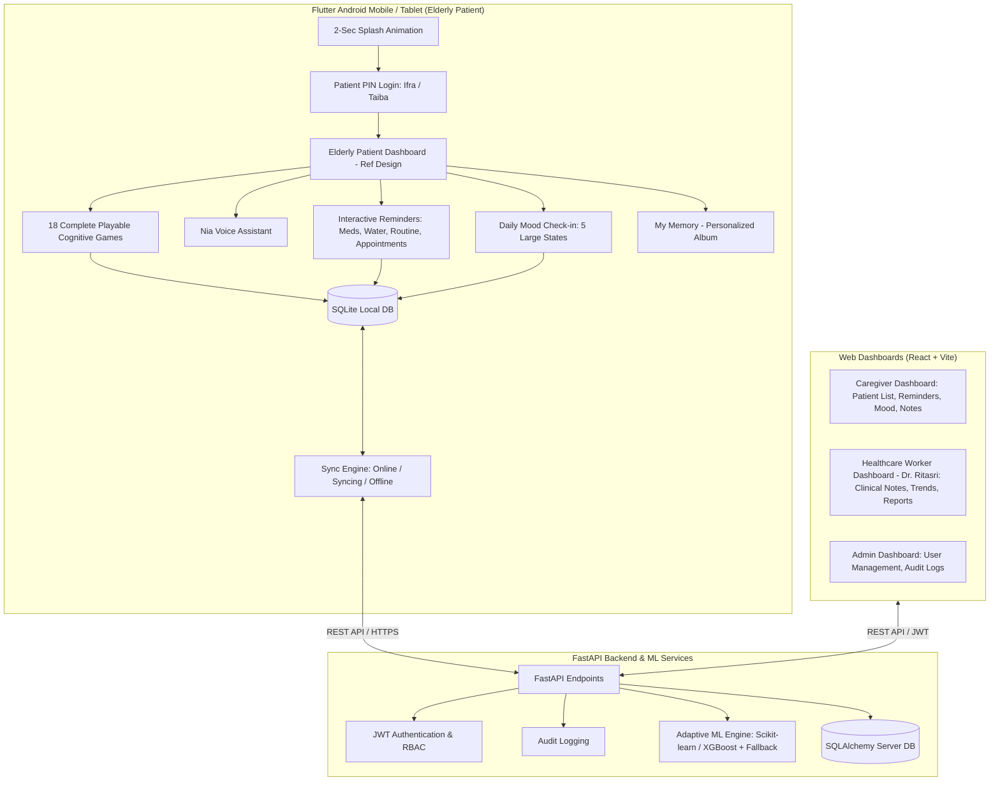

# NEURAL NEXUS

> **"Small Steps. Stronger Memories."**
> AI-Based Cognitive Gaming and Memory Assistance Platform for Elderly Dementia Patients in North Eastern Region (NER).
> **SIH 2026 Problem Statement ID:** 26003 | **Theme:** MedTech / HealthTech | **Category:** Software

---

## 1. Project Overview

**Neural Nexus** is a specialized cognitive engagement, memory assistance, and caregiver-support platform specifically designed for elderly individuals experiencing memory challenges and early cognitive decline.

Built for the multi-cultural context of India's North Eastern Region (NER), Neural Nexus bridges the gap between rural low-connectivity home care and clinical oversight.

### Key Pillars
- **Elderly-Friendly Touch UI:** Large tactile cards, soft pastel gradients, 3D companion illustrations, zero confusing gestures or tiny buttons.
- **18 Playable Cognitive Games:** Covering Memory, Attention, Pattern Recognition, Daily Routine Sequence, Language, Auditory Memory, and Emotion.
- **Explainable Adaptive AI Engine:** Dynamically modulates game challenge from Level 1 to Level 5 based on multi-session telemetry ($40\% \text{ Accuracy} + 25\% \text{ Speed} + 20\% \text{ Consistency} + 15\% \text{ Completion}$).
- **Role Separation & Data Isolation:** Dedicated isolated workspaces for Patients (**Ifra**, **Taiba**), Caregivers (**Ananya**), Healthcare Workers (**Dr. Ritasri**), and System Admins.
- **Offline-First Architecture:** Local SQLite databases queue game sessions and reminder completions when offline, syncing automatically when connectivity is restored.
- **NIA Voice Assistant:** Neural Interactive Assistant supporting voice commands and text-to-speech fallback.
- **Multilingual Localization:** Out-of-the-box support for English, Hindi, and Assamese (অসমীয়া), architected for expansion to additional NER regional languages.
- **Medical Ethics & Safety:** Strictly non-diagnostic; provides cognitive stimulation and caregiver assistance without clinical labeling.

---

## 2. System Architecture



---

## 3. Demo Credentials

| Role | Username / Email | PIN / Password | Description |
| :--- | :--- | :--- | :--- |
| **Patient 1** | `Ifra` | PIN: `1234` | Patient profile with 2 completed games, 2 pending reminders, calm mood |
| **Patient 2** | `Taiba` | PIN: `1234` | Patient profile with isolated history, 1 routine game, Hindi language preference |
| **Healthcare Worker** | `ritasri@neuralnexus.demo` | `Doctor@123` | Dr. Ritasri: Clinical observations, cognitive domain breakdown, reports |
| **Caregiver** | `caregiver@neuralnexus.demo` | `Caregiver@123` | Ananya Sharma: Patient tracker, reminders manager, My Memory album editor |
| **System Admin** | `admin@neuralnexus.demo` | `Admin@123` | System administrator: User roster, security audit log inspector |

---

## 4. Complete Cognitive Game Library (18 Playable Games)

1. **Remember the Objects** (`memory`): Memorize 3-5 objects for 6 seconds, hide, and select which items were shown.
2. **Memory Match** (`memory`): Flip cards to find matching pairs of familiar objects (3 to 6 pairs).
3. **Daily Routine Order** (`routine`): Arrange morning activities using accessible Up/Down touch buttons.
4. **Find the Different Object** (`attention`): Spot the odd item out from a grid (e.g. 🍎 🍎 🍎 🍊 🍎).
5. **Twin Shapes & Colors** (`attention`): Match objects by color, shape, or exact twin.
6. **Pattern Completion** (`pattern`): Complete visual patterns (Circle -> Square -> Circle -> ?).
7. **Object Categorization** (`pattern`): Sort everyday objects into Food, Clothes, Medicine, or Household.
8. **Story Recall** (`language`): Listen to a soothing short story and answer 2-3 accessible choice questions.
9. **Emotion Recognition** (`emotion`): Identify feelings from friendly, smiling, or surprised faces.
10. **Face & Name Memory** (`memory`): Personalized game recalling family members and caregivers ("Who is Meena?").
11. **Location Memory** (`memory`): Recall where household items were placed (Keys in Drawer, Cup on Table).
12. **Sound Memory** (`auditory`): Remember and repeat sequences of soothing everyday sounds (Bell, Water, Bird).
13. **Word Recall** (`language`): Recall comforting words shown earlier in the session.
14. **Object Recognition** (`language`): Recognize everyday items with multilingual audio and text labels.
15. **Simple Sequence Recall** (`memory`): Sequential item order recall.
16. **Which One is Missing?** (`memory`): Identify which object was removed from a group.
17. **Match Related Pairs** (`pattern`): Pair associated items (Cup + Saucer, Lock + Key, Toothbrush + Paste).
18. **Picture & Word Match** (`language`): Connect pictures of everyday items with their written names.

---

## 5. Quick Start & Execution Guide

### Prerequisites
- **Python 3.10+** (Python 3.14 compatible)
- **Node.js 18+** & npm
- *(Optional for Mobile APK compilation)* **Flutter SDK 3.x+** & Android SDK

### 1. Start the FastAPI Backend
```bash
# Seed the database with demo patients, 18 games, and records
python backend/seed_demo_data.py

# Launch the FastAPI backend server
uvicorn backend.app.main:app --host 127.0.0.1 --port 8000 --reload
```
- API Root: `http://127.0.0.1:8000/`
- Interactive OpenAPI Docs: `http://127.0.0.1:8000/docs`

### 2. Start the Caregiver & Healthcare Web Dashboards
```bash
cd web
npm install
npm run dev
```
- Open `http://localhost:5173` in your browser.
- Use the one-click demo buttons to log in as **Dr. Ritasri** or **Caregiver Ananya**.

### 3. Run Automated Tests
```bash
# Run Adaptive AI Engine Unit Tests
python -m unittest discover adaptive_engine/tests -v

# Run Backend API & Security Tests
python -m pytest backend/tests -v

# Run Web Dashboard Production Build
cd web && npm run build
```

---

## 6. Android APK Build Instructions

The complete Android project is configured in `mobile/` with `applicationId "com.neuralnexus.app"`.

When building on an environment with the Flutter & Android SDK installed:

```bash
cd mobile

# Fetch Flutter packages
flutter pub get

# Analyze Dart source code
flutter analyze

# Run Flutter tests
flutter test

# Generate Production Android Release APK
flutter build apk --release
```

**Expected APK Destination:**
```
mobile/build/app/outputs/flutter-apk/app-release.apk
```

*(Note: On systems where Flutter SDK is not installed in PATH, the full Flutter source code and Android Gradle project are completely configured and ready for immediate compilation upon installing the SDK).*

---

## 7. Medical & Ethical Disclaimer

> **IMPORTANT:** Neural Nexus is a cognitive stimulation, memory assistance, and caregiver-support platform. It is strictly not a clinical diagnostic tool and does not generate automated dementia or neurological diagnoses. Game performance metrics are utilized solely for adjusting game pacing and providing non-alarmist caregiver reminders.
